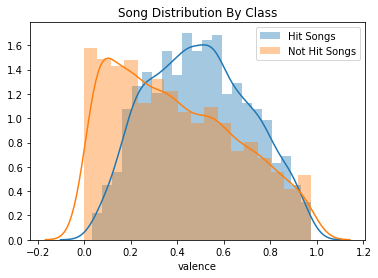
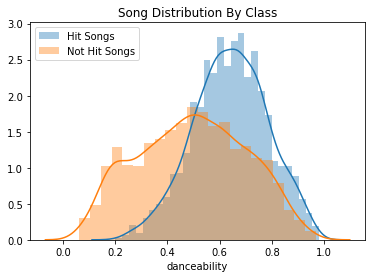
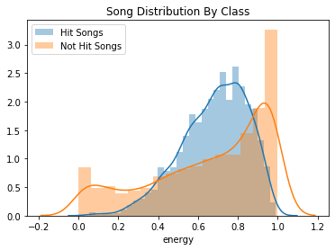

## Project Goals
    - The goal of this project is to predict which songs are 
    classified as a "Hit" and which songs are classified as a "Flop'. 
    If the model is successfull, playlist curators and radio program directors 
    can use it as a tool to identify what music has the potential to appeal to a mainstream audience. 

## Data Collection
   - The dataset consisted of 6400 songs that were collected using Spotify's API. 
    I analyzed each class of song (Hit or Flop) using the following 15 audio features:
        1. Danceability
        2. Energy
        3. Loudness
        4. Speechiness
        5. Acousticess
        6. Instrumentalness
        7. Liveness
        8. Valence
        9. Tempo
        10. Duration
        11. Chorus Hit
        12. Sections
        13. Key
        14. Mode
        15. Time Signature
    
   - Target Variable consists of two evenly balanced classes:
        - Hit (has a value of 1)
           - A track is defined as a Hit if it was listed on the Billboard Hot 100 chart at least once between 2010 and 2019
        
        - Flop (has value of 0)
           - A track is defined as a flop if any one of the following criteria is true:
                - The track must not appear in the 'hit' list of that decade.
                - The track's artist must not appear in the 'hit' list of that decade.
                - The track must belong to a genre that could be considered non-mainstream and/or 
                avant-garde.
                - The track's genre must not have a song in the 'hit' list.
                
## EDA
  
### Data Cleaning
   - The dataset was already clean when I recieved it. There were no missing values or outliers that I had to handle. 
    I did look at all the variables to identify the continuous and categorical variables.
       
      - Categorical features are defined as any column that has less than 12 unique values 
        (Key, Mode, Time Signature).
       
      - Continuous features are all the others that have more than 12 unique values
       
      - I converted the values for Key from an integer-based system to an music key notation 
        (C, C-sharp, F minor, etc).

### Data Exploration
   - After analyzing the distribution of my continuous variables, 
    I noticed a difference in the variance between the two groups of songs. 
    Just looking at Energy, Danceability, and Valence, 
    the range of Hit songs appear to be much slimmer than non-hit songs. 
    These insights are not groudbreaking, but nonetheless confirm the idea 
    that pop songs are formulaic and have little varience.
   
   - Another useful insight came from looking at the categorical variables. 
    For instance, Hit songs tend to favor the key of C and being in a major scale, 
    confirming that pop songs are generally more upbeat and positive.

## Model & Results
   -After training my data on severals models, my best F1 Score was achieved from an 
    XGBoost model optimimized using GridsearchCV. Out of 831 actual hit songs from my test dataset, 
    my model predicted 731 of those to be True Positives, 
    giving me a recall rate of 88%. And out of 890 songs that my model predicted to be Hits, 
    that caused muy precision rate to be 83%
    
    
    
   - Feature importance also indicated favorability towards 'Speechiness' and 'Acousticness'. 
    Knowing that Hip Hop and Rap songs have increased in popularitiy over the past 10 years, 
    the slight lean towards a higher speechiness value makes sense. However, 
    further analysis on genre is needed to confirm this insight.
